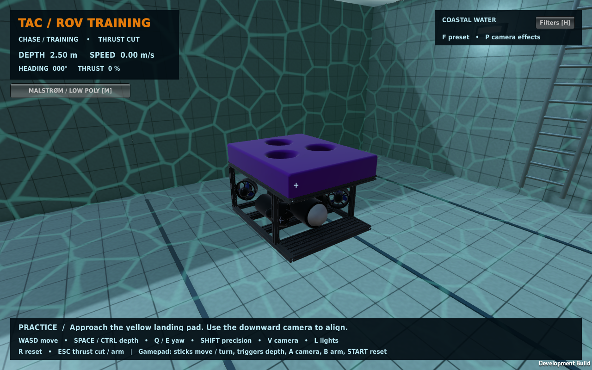
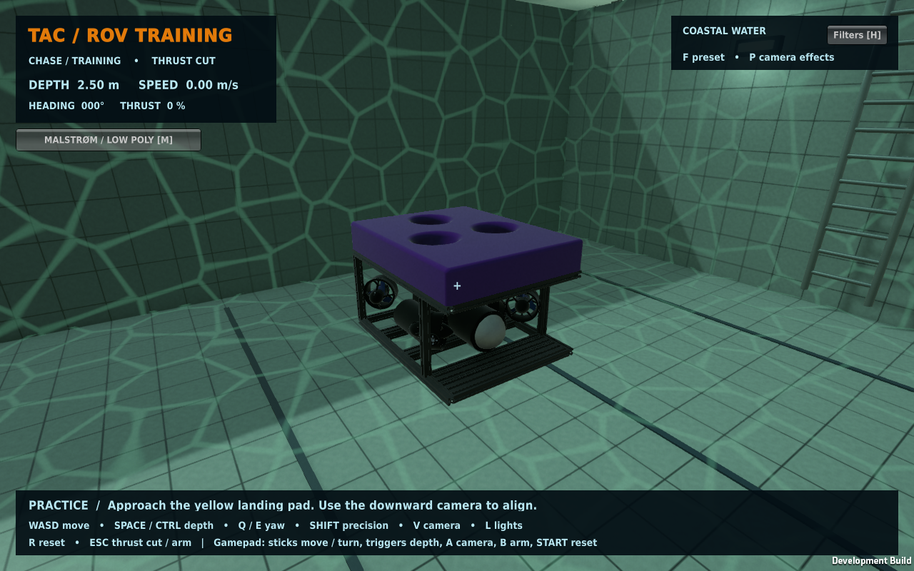

# Malstrøm model

The user-supplied original and simplified Blender assemblies are stored on the
team Drive with the corresponding Unity FBX exports. Git stores their checksums,
Unity import metadata, URP material palette, and integration code—not the large
model binaries. Original files in the external modeling project were not modified.

| Variant | Blender triangles | Unity imported triangles | Default |
| --- | ---: | ---: | --- |
| Low / simplified | 1,462,977 | 1,462,069 | Yes |
| High / full | 2,517,457 | 2,516,549 | No |

Unity's import removes some degenerate geometry. Both exports retain the assembly
hierarchy, imported normals and CAD colors (39 URP materials). Presentation cameras
and lights are excluded. The high model is instantiated on first selection and then
retained for quick switching; this is manual detail selection, not distance-based LOD.

Actual bounds are approximately 0.406 × 0.320 × 0.515 m (Unity X/Y/Z). Render geometry
is centered around the vehicle body because the CAD origin is not its center of
mass. One simple box collider fits those dimensions in both modes. The prior
procedural geometry is hidden at runtime. Camera/headlight offsets now fit the
smaller hull. The mass, displaced volume, drag and generic eight-thruster mixer
are still uncalibrated simulation parameters, not measured Malstrøm dynamics.
The domed enclosure end is assumed to be the front and rotated toward Unity +Z;
confirm this against the team's intended physical front/camera mounting.

## Re-export and update

```bash
blender --background /path/to/source.blend \
  --python scripts/export_rov.py -- Unity/Assets/External/ROV/malstrom-low.fbx
# Repeat for the full source → malstrom-high.fbx.
```

The exporter also produces `assets/rov-materials.json`. In Unity use
**TAC → Import Malstrom models** to remap the palette and configure the existing
training scene. This saves that scene; save your own scene edits first.
Then publish each changed payload with `assets.sh publish`, commit metadata/material
changes, and run `assets.sh release`. Build with **TAC → Build Linux player**.

## Unity gameplay screenshots

Captured directly from the Linux Unity player at 1280 × 800, at the same front
inspection angle, pose and
Coastal Water preset. “Filters off” disables camera post-processing only: water fog,
lighting and caustics remain. These are gameplay captures, not Blender renders.

| Detail | Camera filters off | Camera filters on |
| --- | --- | --- |
| Low |  |  |
| High |  |  |

Reproduce after building:

```bash
./run.sh -smokeTest -captureModels "$PWD/docs/screenshots" \
  -logFile /tmp/tac-model-smoke.log
```
